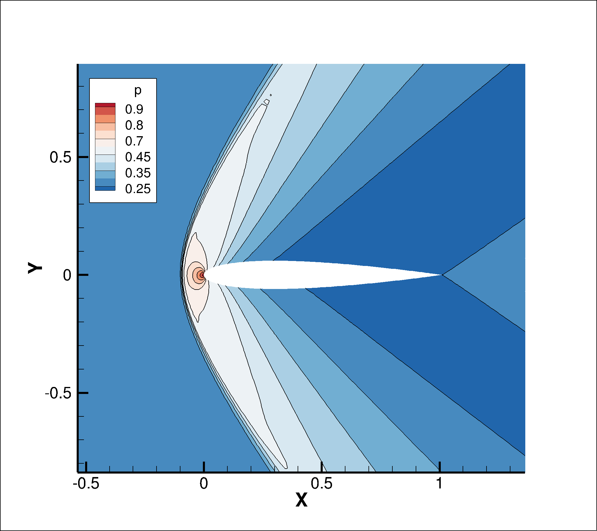

# **Objective**  

The purpose of this solver is to compute fluid flow around airfoils by solving the **Euler equations** using the **Finite Volume Method (FVM)**. The key objectives are:  

- **Accuracy**: Efficiently capture flow characteristics in subsonic, transonic, and supersonic regimes.  
- **Speed**: The solver is entirely **vectorized**, enabling faster computations and efficient handling of large grids.

  
  
  

# **Input and Output**

## **Input**  
The solver requires the following input:  
- **Mesh Grid**: The computational mesh must be provided in **Plot3D** format. This format defines the grid points and the structure of the mesh.  
- **Farfield Mach Number**: The freestream Mach number used to define the flow conditions at infinity.  
- **Angle of Attack (AOA)**: The angle of attack of the airfoil, typically specified in degrees.  

## **Output**  
The solver generates the following outputs:  
- **Cp Curve**: The pressure coefficient (Cp) curve along the surface of the airfoil, visualizing pressure distribution.  
- **Aerodynamic Coefficients**:  
  - **Cl**: Lift coefficient.  
  - **Cd**: Drag coefficient.  
  - **Cm**: Moment coefficient (calculated at the quarter chord).  
- **Computational Time**: The total time taken for the simulation to run.  
- **Residuals Plot**: A plot showing the convergence of the residuals during the simulation.  
- **.dat File**: Data file containing the simulation results, which can be imported into **Tecplot 360** for further post-processing and visualization.

# **Boundary Conditions**  
- **Inflow and Outflow**: Implemented using Riemann invariants for both subsonic and supersonic flow conditions.  
- **Wall Boundary**: A no-slip condition is implemented to simulate the effects of a solid wall on the flow field.  

# **Numerical Schemes**  
The solver includes the following numerical methods:  

- **Convective Fluxes**: Central scheme with artificial dissipation.  
- **Time Integration**:  
  - Explicit Euler time integration scheme.  
  - Runge-Kutta 2nd order (RK2) integration scheme.  
- **Time Stepping**:  
  - Global time step for all grid cells.  
  - Local time step for increased efficiency (acceleration technique).  

# **Code Structure**  
- `NACA0012grids/`: Contains all the grids used.  
- `modules/`: Source files of the solver (Python).  
- `examples/`: Verification results for NACA0012 airfoil, including:  
  - **Flow regimes**: Subsonic \(M = 0.5\), Transonic \(M = 0.8\), and Supersonic \(M = 1.5\).  
  - **Angles of Attack**:  0° and 1.25°.  
- `main.py`: Main script to modify and adapt the simulation to your specific case.  

# **Dependencies**  

The solver relies on the following Python libraries and built-in modules:

- **`os`**: Used for file and directory manipulation, including creating directories with `makedirs`.  
- **`time`**: Utilized for performance tracking and timing the computation process.  
- **`matplotlib`**: A plotting library for visualizing results
- **`numpy`**: A fundamental library for numerical computing, used for array manipulation and mathematical operations.

